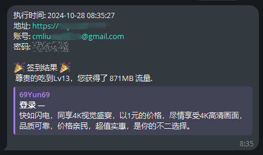

# 🤖 CF-Workers-checkin

## 🚀 使用方法
- 示例项目地址: `qd.google.workers.dev`

### 🔔 检查 TG 通知
- 访问 `https://qd.google.workers.dev/tg`

> [!WARNING]
> 关注 TG 通知机器人 [@CMLiussss_bot](https://t.me/CMLiussss_bot)，即可获取 **TGID**

### 👆 手动签到
1. 示例机场密码: `password`
2. 访问 `https://qd.google.workers.dev/password`

### ⏰ 设置自动签到
1. 前往 **设置** > **触发事件** > **+添加** > **Cron 触发器**
2. 选择 **每天** 和 **00:00**（建议根据需求调整时间）
3. 点击 **添加** 完成设置

> [!CAUTION]
> 请注意，Cloudflare 使用的是 UTC 标准时间，与北京时间有 8 小时的时差！

## 📋 变量说明
| 变量名        | 示例                                   | 必填 | 备注                                                |
|---------------|----------------------------------------|------|-----------------------------------------------------|
| `JC`/`DOMAIN` | `jichangyuming.com`                     | ✅   | 机场域名                                            |
| `ZH`/`USER`   | `admin@google.com`                      | ✅   | 机场账户邮箱                                        |
| `MM`/`PASS`   | `password`                              | ✅   | 机场账户密码                                        |
| `TGID`        | `6946912345`                            | ❌   | 接收 TG 通知的账户数字 ID                           |
| `TGTOKEN`     | `6894123456:XXXXXXXXXX0qExVsBPUhHDAbXXX` | ❌   | 发送 TG 通知的机器人 token（默认使用内置 [@CMLiussss_bot](https://t.me/CMLiussss_bot)） |

# 🙏 致谢
[CM通知机器人](https://github.com/cmliu/CF-Workers-TGbot)